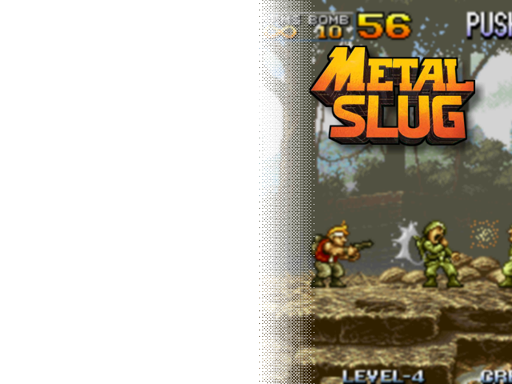
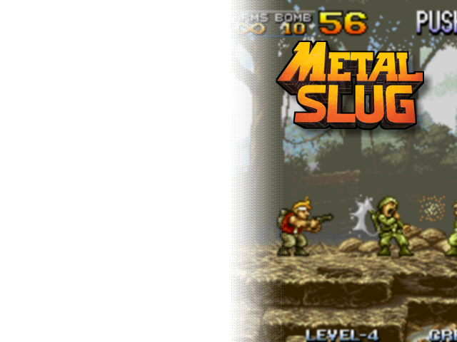
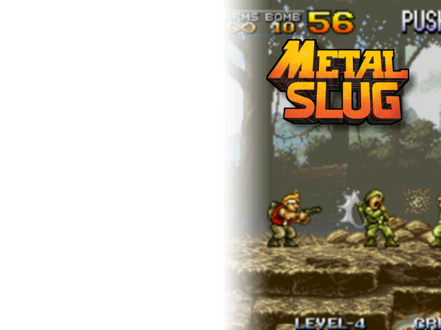
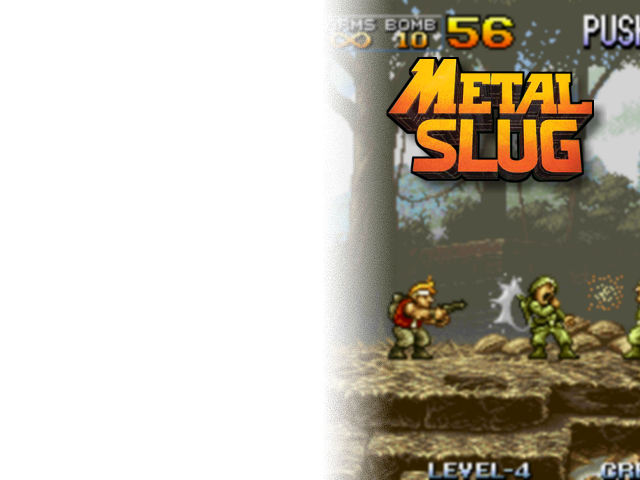
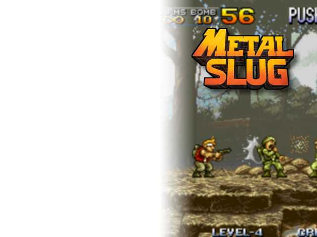
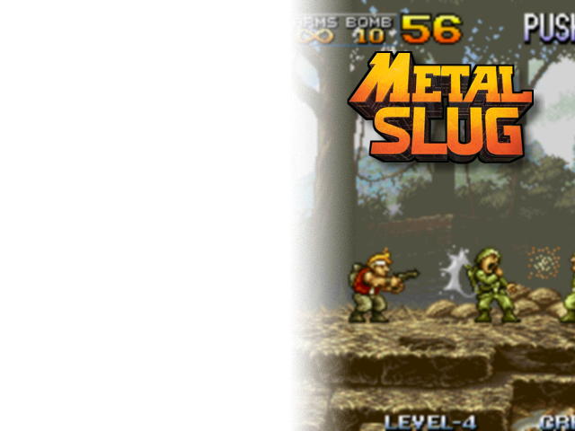
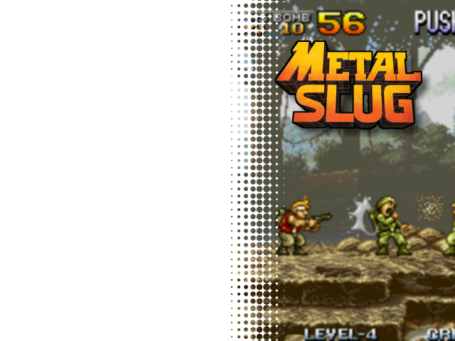

# Transparency gradients in 640x480 masks

These masks are 640x480. The gradient starts at `x=320` (middle) and ends at `x=400` : 100% transparent before 320 and 100% plain after 400. The middle of the gradient is at `x=360`.

The PNG files must sit in your `~/.skyscraper/ressources` folder. You may also use subfolders, but then you should adapt the XML mix.

```
pierre@Legion:~$ ls .skyscraper/resources/
boxfront.png      maskexample.png          muos-gradient-dither.png  muos-grain-low.png      scanlines1.png
boxside.png       muos-dithering-bw.png    muos-gradient-soft.png    muos-grain-mid.png      scanlines2.png
frameexample.png  muos-dithering-gray.png  muos-grain-high.png       muos-halftone-dots.png
```

The available masks are the following :

  - `muos-gradient-soft.png` is a greyscale gradient without any king of dithering. It is versy soft but may lead to banding artifacts
  - `muos-gradient-dither.png` is the same as the previous one, but with Photoshop's super mild dithering 
  - `muos-dithering-bw.png` is a retro 2 colors dithering with a late 80's look 
  - `muos-dithering-gray.png` is a retro grayscale dithering with a 90's look
  - `muos-halftone-dots.png` is a vintage dotted halftone dithering
  - `muos-grain-low.png` adresses banding with a low intensity grain ; this is a goofd tradeoff and the XML sample mixes use this mask   
  - `muos-grain-high.png` adresses banding with a medium intensity grain 
  - `muos-grain-mid.png` adresses banding with more visible grain

<kbd>
  

  muos-dithering-bw.png
</kbd>

<kbd>
  
</kbd>

<kbd>
  
</kbd>

<kbd>
  
</kbd>

<kbd>
  
</kbd>

<kbd>
  
</kbd>

<kbd>
  
</kbd>

