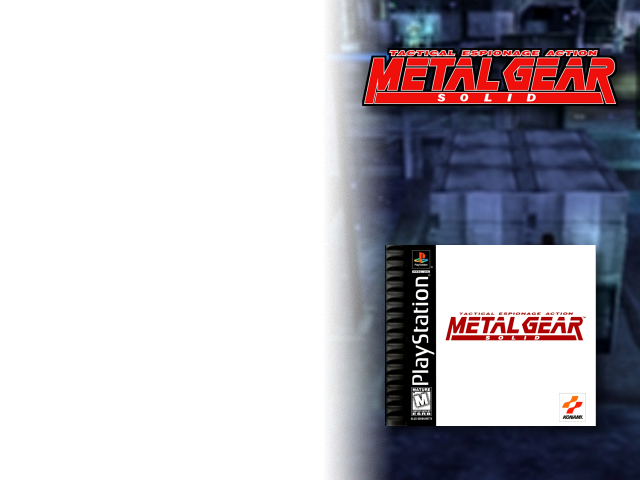
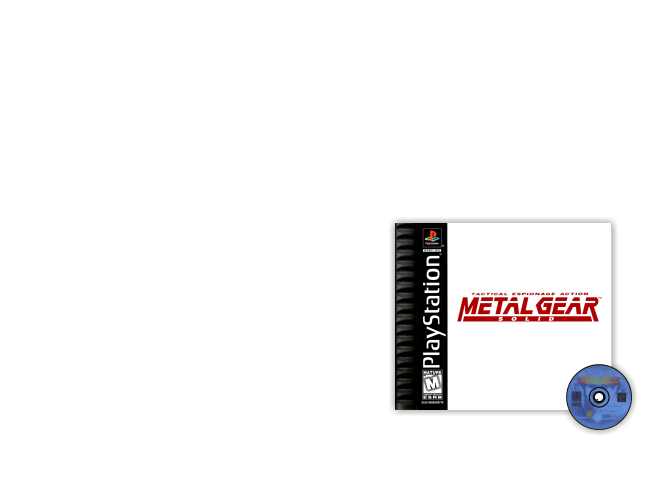
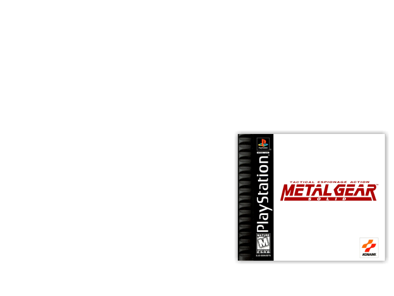

## Custom mixes

This is Skyscraper XML and not Skraper XML since the latter doen't handle transparency masks. Edit the XML file to change the type of mask if you prefer another gradient type. 

This XML mixes are designed to be used with MuOS and the provided transparency masks. In MuOS, the top and bottom bars are 42pix height each. And the gradient in this mask always start at x=320. The themes are taylored to accomodate worst case vertical screenshots up to 2:3 aspect ratio such as NDS with the two screens stacked. 

<kbd>
  

  full-gradient-screen-wheel-box.xml

  

  full-gradient-screen-wheel.xml

  

  inner-gradient-screen-wheel-box.xml

  

  inner-gradient-screen-wheel.xml

  

  simple-box-cart.xml

  

  simple-box-flat.pxml

  

  simple-box.xml
</kbd>

